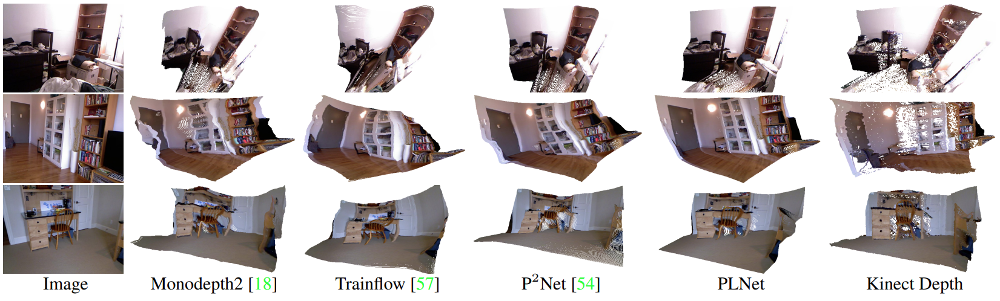

# PLNet
The Pytorch code for our following paper

> **PLNet: Plane and Line Priors for Unsupervised Indoor Depth Estimation**, [3DV 2021 (pdf)](https://arxiv.org/pdf/2110.05839.pdf)
>
> [Hualie Jiang](https://hualie.github.io/), Laiyan Ding, Junjie Hu and Rui Huang




## Preparation

#### Installation

Install pytorch first by running

```bash
conda install pytorch=1.5.1 torchvision=0.6.1  cuda101 -c pytorch
```

Then install other requirements

```bash
pip install -r requirements.txt
```

#### Datasets & Preprocessing 

Please download preprocessed (sampled in 5 frames) [NYU-Depth-V2](https://drive.google.com/file/d/1WoOZOBpOWfmwe7bknWS5PMUCLBPFKTOw/view?usp=sharing) dataset by [Junjie Hu](https://scholar.google.com/citations?user=nuZZKu4AAAAJ&hl=en&oi=sra) and extract it. 

Extract the superpixels and line segments by excuting

```
python extract_superpixel.py --data_path $DATA_PATH
python extract_lineseg.py --data_path $DATA_PATH
```


## Try an image 

run *depth_prediction_example.ipynb* with jupyter notebook


## Training 

#### Using 3 Frames

```
python train.py --data_path $DATA_PATH --model_name plnet_3f --frame_ids 0 -2 2 
```

#### Using 5 Frames

```
python train.py --data_path $DATA_PATH --model_name plnet_5f --frame_ids 0 -4 -2 2 4
```


## Evaluation  

The pretrained models of our paper is available on [Google Drive](https://drive.google.com/file/d/1WaUutZLcJ8C2EudnCUV2Ei9aCy3OePaG/view?usp=sharing). 

#### NYU Depth Estimation

```
python evaluate_nyu_depth.py --data_path $DATA_PATH --load_weights_folder $MODEL_PATH 
```

#### ScanNet Depth Estimation

```
python evaluate_scannet_depth.py --data_path $DATA_PATH --load_weights_folder $MODEL_PATH 
```

#### ScanNet Pose Estimation

```
python evaluate_scannet_pose.py --data_path $DATA_PATH --load_weights_folder $MODEL_PATH --frame_ids 0 1 
```

Note: to evaluate on ScanNet, one has to download the preprocessed [data](https://onedrive.live.com/?authkey=%21ANXK7icE%2D33VPg0&id=C43E510B25EDDE99%21106&cid=C43E510B25EDDE99) by  P^2Net. 


## Acknowledgements

The project borrows codes from [Monodepth2](https://github.com/nianticlabs/monodepth2) and [P^2Net](https://github.com/svip-lab/Indoor-SfMLearner). Many thanks to their authors. 

## Citation

Please cite our papers if you find our work useful in your research.

```
@inproceedings{jiang2021plnet,
  title={PLNet: Plane and Line Priors for Unsupervised Indoor Depth Estimation},
  author={Jiang, Hualie and Ding, Laiyan and Hu, Junjie and Huang, Rui},
  booktitle={In IEEE International Conference on 3D Vision (3DV)},
  year={2021}
}
```
